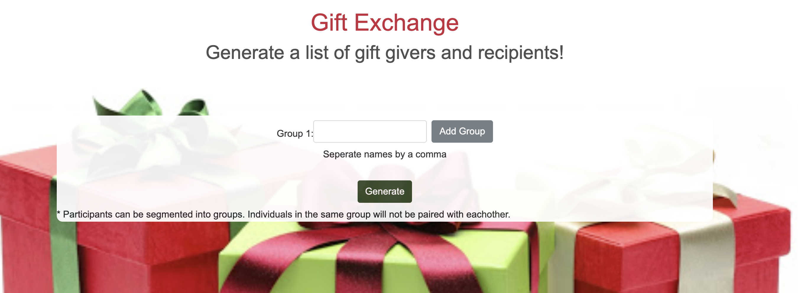

# Secret Santa

## Description
Generate secret santa pairings of givers and recipients. Groups allow for participants to avoid being paired with other participants in the same group. For example, when doing an extended family exchange spouses won't be paired if the are in the same group.

If all participants can be paired then each will be in thier own group. 

## Screenshot

## Website
